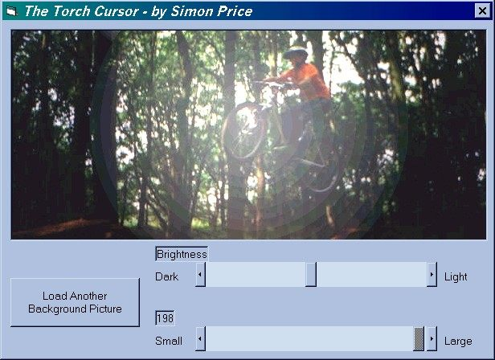

## TORCH CURSOR\! \- Interacts with pictures\!\!\!

### Description

You'll love this! This is a cursor which interacts with a picturebox by lighting it up around the cursor position! Look at the screenshot. You can choose any picture you want, and the size and brightness of the torch can be chosen too! (Although larger torches run slowly). If you think this is cool/interesting/well programmed/original then please vote. The code is fully commented. Also look at my other submission of a transition special effect (look in best code of the month).
 
### More Info
 

             |
---                |---
**Submitted On**   |2000-07-11 18:12:02
**By**             |[Simon Price](https://github.com/Planet-Source-Code/PSCIndex/blob/master/ByAuthor/simon-price.md)
**Level**          |Beginner
**User Rating**    |4.7 (52 globes from 11 users)
**Compatibility**  |VB 3\.0, VB 4\.0 \(16\-bit\), VB 4\.0 \(32\-bit\), VB 5\.0, VB 6\.0, VB Script, ASP \(Active Server Pages\) 
**Category**       |[Graphics](https://github.com/Planet-Source-Code/PSCIndex/blob/master/ByCategory/graphics__1-46.md)
**World**          |[Visual Basic](https://github.com/Planet-Source-Code/PSCIndex/blob/master/ByWorld/visual-basic.md)
**Archive File**   |[CODE\_UPLOAD76917112000\.zip](https://github.com/Planet-Source-Code/simon-price-torch-cursor-interacts-with-pictures__1-9684/archive/master.zip)

